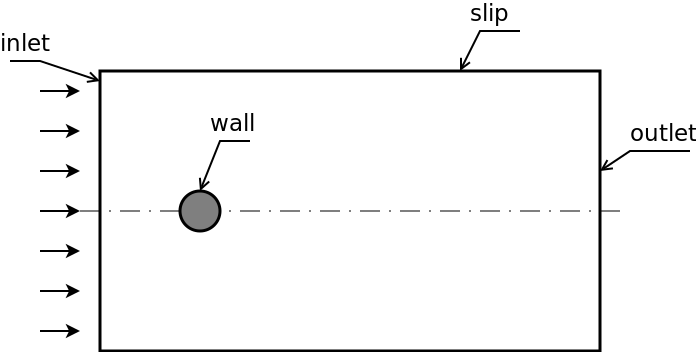

# Flow over cylinder

This OpenFOAM cases demonstrate different mesh-generation strategies for 
the same physical problem: laminar vortex shedding.

## Case description

We create a two-dimensional mesh to simulate the flow over a cylinder. From the 
flow conditions we expect laminar vortex shedding.

### Note

In OpenFOAM a two-dimensional mesh is actually three-dimensional, as all 
meshes are three-dimensional in OpenFOAM. For a two-dimensional simulation, 
we create a mesh, that is one cell thick. This can be done by creating a 
3D mesh with one cell in thickness-direction, or extruding a single-cell cell 
layer from a 2D mesh.

The cases using blockMesh and GMSH create proper 3D meshes, with just a single 
cell in thickness. The case using snappyHexMesh is using the latter approach.

## Meshing

### blockMesh

We show two blocking strategies for the simulation domain. These two blocking 
strategies are translated into a python script. The parameters at the top of 
the script control geometric dimensions and mesh resolution.

### snappyHexMesh

Although snappyHexMesh is a fully 3D mesh generator, we create - with the help 
of some workarounds - a 2D mesh.

Since we can not prevent snappyHexMesh from refining cells in all directions, 
we extrude a single-cell cell layer from the mesh created by snappyHexMesh and 
discard the other cells. Thus, we end up with a 2D mesh for OpenFOAM.

The STL surface of the cylinder is created by 
[OpenSCAD](https://github.com/openscad/openscad). This tool is open source under 
the GPL and is available for all platforms.

### GMSH

With the meshing tool [GMSH](http://gmsh.info/), we create a two-dimensional, 
unstructured mesh.

GMSH is open source under the GPL and binaries are available for all platforms 
(Windows, Linux and Mac).

## Post-processing

A functionObject is used to evaluate the force coefficients on the cylinder. 
An octave script reads the data of the lift coefficient over time and computes 
the dominant frequency. This frequency is then compared to the frequency 
calculated from the Strouhal number, flow velocity and cylinder diameter.

[Octave](https://www.gnu.org/software/octave/) is open source under the GPL and 
is available for all platforms. Octave is widely compatible to MATLAB, so you 
can run the post-processing script also with MATLAB.

